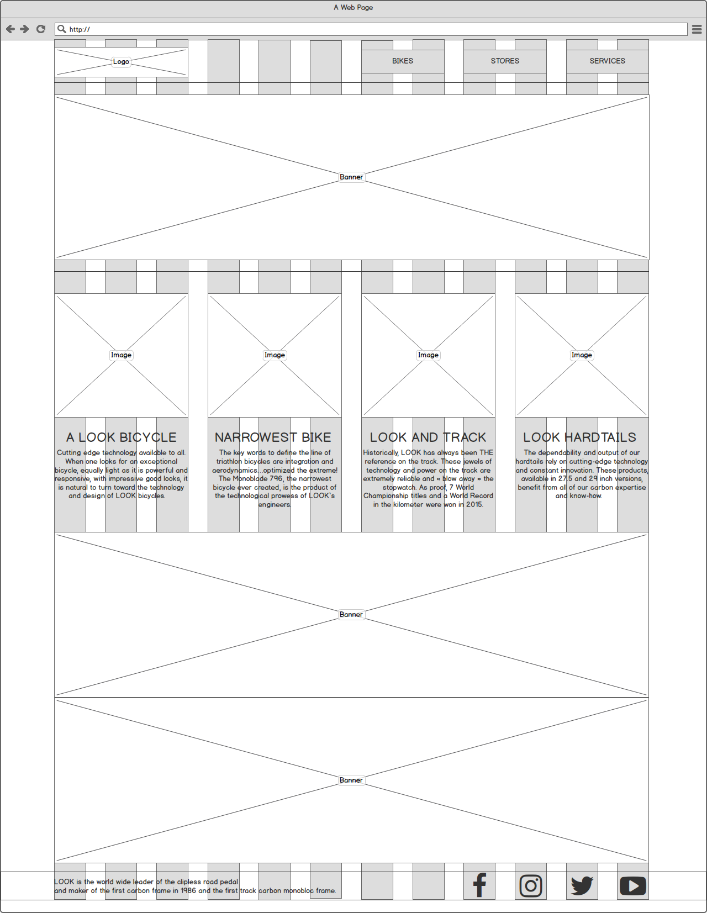
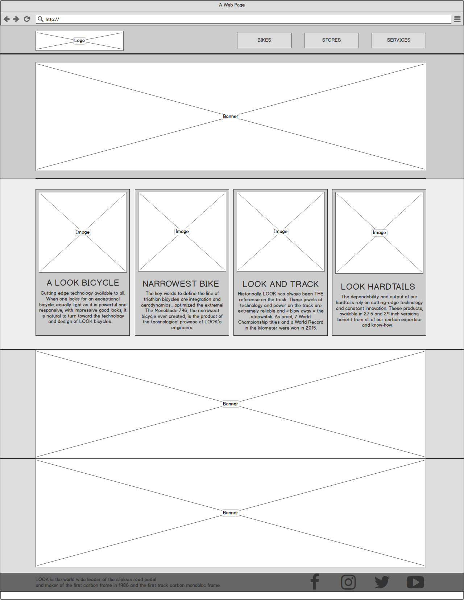

Week 5 Wireframe design
===

2017 Web design course student demonstration file for homework on week 5.

All resources were refer to LOOK Cycle web layout design
and all images, logo assets file in these directory only for educational demonstration.

Meanwhile, all files and design in the folder are only for practicing, it is totally not for commercial,
So if have any issues for using these images for education,
please contact me and let me know,  thanks.

## Wireframe (grid)

## Wireframe (gray scale)

## Wireframe (color)

## Source
- [LOOK Cycle](http://www.lookcycle.com/en/)
